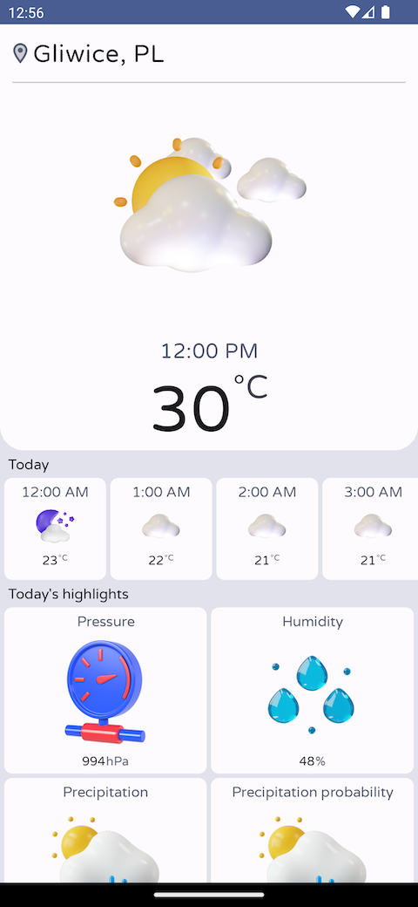
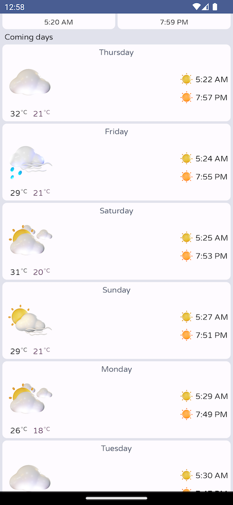

# Weather
Weather app for portfolio and educational purposes. Made for Android phones/tablets with Jetpack Compose and Weather Forecast API from https://open-meteo.com/

# About the app
Application shows current weather with highlights, hourly and daily forecast for current location.

  
  

# Technology and techniques
Used technology and programming techniques:
* Android SDK
* Kotlin
* Coroutines
* MVVM pattern
* Jetpack Compose
* Dependency Injection - manual
* Retrofit (for weather API)
* Coil (for image loading)
* Geocoding

# Credits
Images used in the project loaded from [this repo](https://github.com/hicodersofficial/weather-app/).

